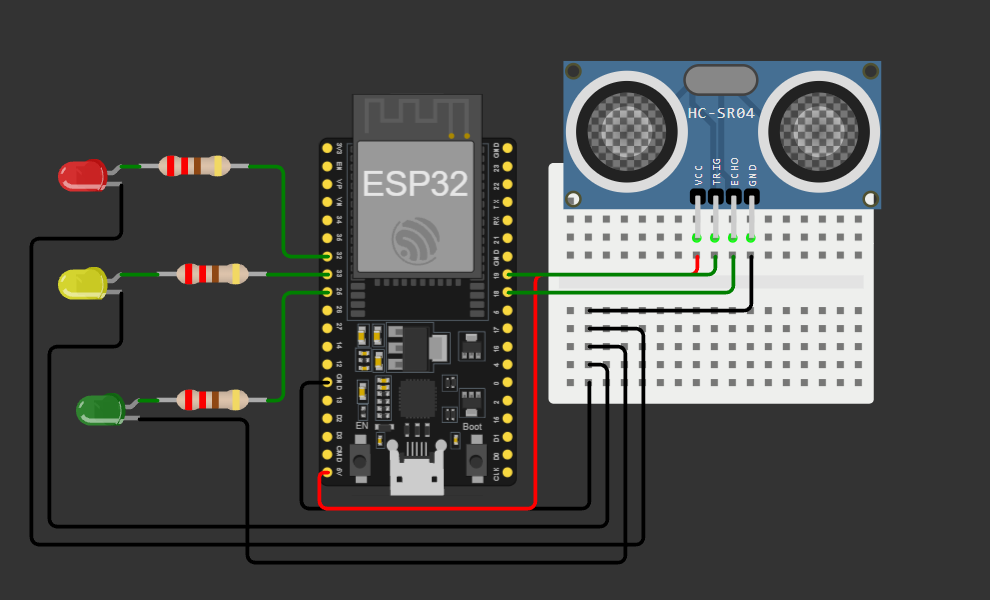

# Smart Traffic Light System

A beginner-friendly IoT project demonstrating autonomous traffic light control using an ESP32 microcontroller and ultrasonic sensor for real-time vehicle detection.

## Overview

This project implements an intelligent traffic light system that dynamically adjusts signal timing based on traffic density. The HC-SR04 ultrasonic sensor detects vehicle presence within a defined range, and the ESP32 microcontroller responds by optimizing green light duration accordingly.

## Key Features

- **Real-time Traffic Detection**: HC-SR04 ultrasonic sensor detects vehicles within 100 cm
- **Dynamic Signal Timing**: Automatically adjusts green light duration based on traffic conditions
- **Automated Sequencing**: Implements standard traffic light cycle (RED → GREEN → YELLOW → RED)
- **Serial Monitoring**: Real-time distance readings and system status via Serial Monitor
- **Expandable Design**: Foundation for advanced smart traffic systems
- **Simulation Ready**: Compatible with Wokwi online simulator

## Hardware Components

| Component | Quantity | Notes |
|-----------|----------|-------|
| ESP32 Microcontroller | 1 | Main control unit |
| HC-SR04 Ultrasonic Sensor | 1 | Vehicle detection |
| Red LED | 1 | Stop signal |
| Yellow LED | 1 | Caution signal |
| Green LED | 1 | Go signal |
| 220Ω Resistor | 3 | LED current limiting |
| Jumper Wires | As needed | Connections |

## Pin Configuration

| Component | ESP32 Pin |
|-----------|-----------|
| RED LED | GPIO 32 |
| YELLOW LED | GPIO 33 |
| GREEN LED | GPIO 25 |
| HC-SR04 TRIG | GPIO 19 |
| HC-SR04 ECHO | GPIO 18 |

## Circuit Diagram



### ASCII Schematic Reference

```
                           ┌─────────────────┐
                           │     ESP32       │
                           │  Microcontroller│
                           │                 │
        ┌──────────────────┤ GPIO 32 (RED)   │
        │                  │ GPIO 33 (YELLOW)│
        │                  │ GPIO 25 (GREEN) │
        │                  │ GPIO 19 (TRIG)  │
        │                  │ GPIO 18 (ECHO)  │
        │                  │ GND             │
        │                  │ 5V/3.3V         │
        │                  └─────────────────┘
        │
   ┌────┴─────┬──────────┬──────────┐
   │           │          │          │
   │          220Ω       220Ω       220Ω
   │           │          │          │
   │      ┌────┴────┐ ┌───┴────┐ ┌──┴─────┐
   │      │ RED LED │ │YELLOW  │ │ GREEN  │
   │      │   ┌────┘ │ LED    │ │ LED    │
   │      │   │      │  ┌─────┘ │  ┌────┘
   │      │   │      │  │       │  │
   │      └───┴──┬───┴──┴───┬───┴──┴────┬──────┐
   │             │          │           │      │
   └─────────────┴──────────┴───────────┴──GND─┘


    ┌────────────────────────┐
    │   HC-SR04 Sensor       │
    │  ┌────────────────────┐│
    │  │ TRIG  │  │  ECHO   ││
    │  │ GND   │  │  5V     ││
    │  └┬───────┐┌┬──┬──────┘│
    │   │       │││  │       │
    │   │       │││  └─GPIO 18
    │   │       │└┘
    │   │       └────GPIO 19
    │   │
    │   └─────────────GND
    │
    └────────────────────────┘
```

### Wiring Summary

**LEDs (with 220Ω resistors in series to GND):**
- Red LED → GPIO 32 → 220Ω Resistor → GND
- Yellow LED → GPIO 33 → 220Ω Resistor → GND
- Green LED → GPIO 25 → 220Ω Resistor → GND

**HC-SR04 Ultrasonic Sensor:**
- TRIG pin → GPIO 19
- ECHO pin → GPIO 18
- VCC → 5V (or 3.3V with level shifter for long cables)
- GND → GND (common ground with ESP32)

**Power & Ground:**
- Connect ESP32 GND and sensor GND to common ground
- Power ESP32 via USB or external 5V supply

## System Logic

### Distance Calculation
```
Distance = (Duration × Speed of Sound) / 2
Distance = (Duration × 0.0343 cm/µs) / 2
```
*The division by 2 accounts for the round-trip signal path.*

### Traffic Detection Algorithm
- **Distance < 100 cm**: Road is busy → Green light: 10 seconds
- **Distance ≥ 100 cm**: Normal traffic → Green light: 5 seconds
- **Yellow light**: 2 seconds (all conditions)

## Signal Timing

| State | Duration |
|-------|----------|
| Green (Heavy Traffic) | 10 seconds |
| Green (Normal Traffic) | 5 seconds |
| Yellow | 2 seconds |
| Red | Automatic cycle |

## Getting Started

### Prerequisites
- Arduino IDE with ESP32 board support
- USB cable for programming
- Wokwi account (for simulation)

### Installation
1. Connect hardware according to pin configuration
2. Open `smart_traffic_light.ino` in Arduino IDE
3. Select ESP32 board and appropriate COM port
4. Upload sketch to the microcontroller

### Testing
1. Open Serial Monitor (115200 baud)
2. Observe distance readings and traffic light state changes
3. Test with hand movements in front of sensor

## Simulation
This project can be simulated using [Wokwi](https://wokwi.com) without physical hardware.

## Learning Outcomes

This project demonstrates:
- ESP32 GPIO programming
- Ultrasonic sensor integration
- Pulse timing and distance calculation
- Conditional logic implementation
- Real-world sensor-based automation
- Traffic system design principles

## Future Enhancements

- Multi-lane intersection support
- Pedestrian crossing integration
- Mobile app for remote monitoring
- Machine learning for adaptive timing
- Solar panel integration
- Emergency vehicle detection

## License

Open source - feel free to modify and distribute.


